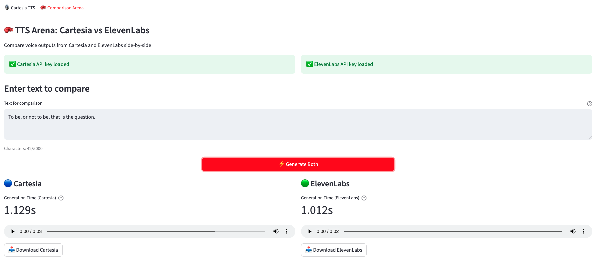

# Cartesia + ElevenLabs TTS Arena (Interview Take‑Home)

A Streamlit app built for a Cartesia take-home assignment: showcase Cartesia's Sonic models, contrast them with ElevenLabs, and document findings for the hiring panel. This README doubles as the landing page for new visitors and the cover sheet for the accompanying report.



## What you can do
- **Convert text to speech with Cartesia.** Pick voices, models, and sample rates, then listen or download the MP3.
- **Run a head-to-head test.** Generate the same text with Cartesia and ElevenLabs, compare timing, and vote for your preferred output.
- **Work with your own keys.** Load secrets from environment variables or paste session-only overrides.
- **Stream the sample outputs.** Open `index.html` (locally or via GitHub Pages) to browse and play everything in `supporting_files/` with deeplinks.

## Interview & report context
- **Prompt:** Deliver a lightweight, developer-friendly UI that exercises Cartesia's TTS APIs and benchmarks them against a familiar baseline (ElevenLabs).
- **Scope:** Keep dependencies minimal, favor readability, and make it easy for reviewers to reproduce runs locally or on a VM.
- **Report:** See `report.md` for notes on evaluation criteria, observations, and open questions to cover in the live debrief.

## Tech stack at a glance
- **Python + Streamlit** for the UI and session state.
- **Cartesia Python SDK** for Sonic 3 / multilingual TTS.
- **ElevenLabs SDK** for the comparison tab.
- **python-dotenv** to load `.env` during local runs.

## Quickstart
1. **Clone & enter the repo**
   ```bash
   git clone <repo-url>
   cd cartesia-exploration-and-assessment
   ```
2. **Create a virtual environment (recommended)**
   ```bash
   python3 -m venv .venv
   source .venv/bin/activate
   ```
3. **Install dependencies**
   ```bash
   pip install -r requirements.txt
   ```
4. **Set API keys** (Cartesia required; ElevenLabs only for the arena tab)
   ```bash
   # .env example
   CARTESIA_API_KEY=your_cartesia_key
   ELEVENLABS_API_KEY=optional_elevenlabs_key
   ```
5. **Run the app**
   ```bash
   streamlit run app.py
   ```
   Open http://localhost:8501 to use the UI.

## Using the app
- **Cartesia tab:** Enter up to ~5k characters, choose a voice/model/sample rate, generate audio, then play or download the MP3.
- **Comparison arena:** Confirm both keys are present, pick voices for each provider, generate side-by-side outputs, view latency, and cast a quick vote.
- **API key controls:** The sidebar shows whether keys were loaded and lets you paste overrides that stay in memory for the session only.

## Repository tour
- `app.py` — Streamlit interface and provider integrations.
- `requirements.txt` — Minimal dependency list.
- `supporting_files/` — Sample audio outputs captured during testing.
- `index.html` — Static audio gallery to stream/deeplink the MP3s in `supporting_files/` without cloning.
- `assets/app-home.jpg` — Current UI screenshot for quick reference.

## Troubleshooting in brief
- Missing key errors: ensure `.env` is populated or paste keys in the sidebar.
- Audio not playing: try another browser and confirm you see network responses in the Streamlit logs.
- Arena tab disabled: you need both Cartesia and ElevenLabs keys to unlock the head-to-head view.

---
